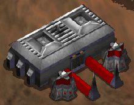
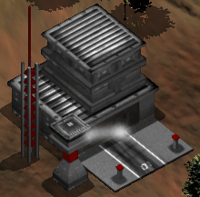
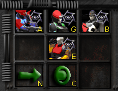
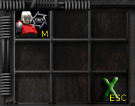
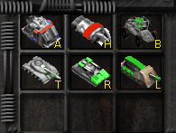
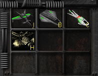

(Disclaimer: this is an independent project, author of this manual is not part of the game development team ([Bos Wars](https://www.boswars.org/) is &copy; 2004-2013 by Tina Petersen Jensen, Francois Beerten et al., and released as free software under GPL v.2 license). As such 1) This work may not be 100% accurate, and 2) Game authors must not be bothered for problems in this manual.)

# Index

- [Introduction](#introduction)
- [Initial menu](#initial-menu)
- [The map](#the-map)
  - [The mini-map](#the-mini-map)
  - [In-game menu](#in-game-menu)
  - [Units](#units)
  - [Natural objects](#natural-objects)
- [Basic actions: selection and movement](#basic-actions-selection-and-movement)
  - [Selection](#selection)
  - [Movement](#movement)
- [Resources](#resources)
  - [Energy](#energy)
  - [Magma](#magma)
- [Building structures](#building-structures)
  - [The engineer](#the-engineer)
  - [Basic structures](#basic-structures)
    - [Vault](#vault-v)
    - [Magma pump](#magma-pump-m)
    - [Radar](#radar-r)
    - [Camera](#camera-c)
    - [Power plant](#power-plant-p)
    - [Nuclear power plant](#nuclear-power-plant-n)
  - [Unit structures](#unit-structures)
    - [Training camp](#training-camp-c)
    - [Hospital](#hospital-h)
    - [Vehicle factory](#vehicle-factory-v)
    - [Shipyard](#shipyard-s)
    - [Aircraft factory](#aircraft-factory-a)
  - [Defensive structures](#defensive-structures)
    - [Gun turret](#gun-turret-g)
    - [Big gun turret](#big-gun-turret-b)
    - [Cannon](#cannon-c)
    - [Missile silo](#missile-silo-m)
- [Building units](#building-units)
  - [Units from training camp](#units-from-training-camp)
  - [Units from hospital](#units-from-hospital)
  - [Units from vehicle factory](#units-from-vehicle-factory)
  - [Units from shipyard](#units-from-shipyard)
  - [Units from aircraft factory](#units-from-aircraft-factory)
- [Fighting](#fighting)
- [Strategy hints](#strategy-hints)

# Introduction

[Bos Wars](https://www.boswars.org/) is a free-software real-time strategy (RTS) game. In an RTS game you usually have to conquer the whole "world" in a given level, destroying all the enemies in the process. Generally you start in a small corner with very few resources, and you have to build your army (including defenses for your bases) in order to explore and conquer wider and wider areas and defy the enemies you encounter. In doing so you also have to manage the resources you need (energy, materials) and find ever new supplies of them. But beware, enemies in the dark meanwhile are working fast with the same goal, including destroying you, so you must adopt a good strategy and balance all your resources.

# Initial menu

When starting the program you can see the initial menu. Items there are quite self-explanatory, so we will describe them briefly. There are features beyond the scope of this manual, like for example the map editor with which you can create new maps or modify existing ones.

"Options" item allows you to set game options like video resolution, audio, game speed and so on.

"Load game" is for resuming a game you previously saved.

Finally "Start game" is for starting a new game. Once pressed you have to choose a map in the list (you can ignore campaigns initially). When you select a map you can see its details on the left side of the screen, particularly its size, for example 64x64 for smaller ones, up to 256x256. It's highly recommended to start with a small map it you're not so familiar with the game. Leave all the options as they are, at least until you are an expert player, and finally press "Start" to actually start the game.

# The map

The map is where the game takes place. You can distinguish three types of areas:

- Full-bright areas: areas in direct sight from your units, that is where you have at least one of your units. Thanks to physical presence you can see what's actually happening. Every unit has a predefined sight range, usually not too wide.
- Black areas: initially the most part, they are unknown areas where you never went, that will be discovered when reached. This feature can be disabled (so to see the full map from the beginning), but that would arguably compromise the game dynamics.
- Obfuscated areas (half-bright): areas where you previously went but now no more of your units are, for example if all the units in an area have been destroyed. You can still see the area, but you cannot see what's currently happening anymore; you only have a "photo" of the last time you were there, so it may be full of enemies now, but you only can see it when you go there again. This feature is called "fog of war" and can be disabled, too, but again that would take some interest away from the game.

You can scroll the map in the four directions by moving the mouse near the four borders.

## The mini-map

The mini-map, in the upper right corner, gives you a glance of the full map. You can move rapidly through the map by clicking and dragging in the mini-map. Dots of different colors indicate different kind of objects, for example green is your units, blue is enemy units, purple is free magma spots. By building a radar (see ["Building structures"](#building-structures)) you can reveal important objects in the mini-map, even in unexplored areas.

## In-game menu

By pressing F10 during the game you can pause the game and access the menu with game-related actions, like saving, quitting or changing speed. Function keys associated to submenus (F5, F9, etc.) can be pressed to access those submenus directly. Pay attention to the Help submenu (F1), it lists a lot of keyboard shortcuts and general hints that can provide advanced improvements, not always listed in this document.

## Units

Units (humans, vehicles, factories, facilities, etc.) live on the map, unless they are attacked and deprived of all their health, in that case they are killed and disappear. For example the following is an engineer:

This little yellow guy is a very important unit in the game. It cannot fight or defend itself, but it can [build structures](#building-structures) and [harvest resources](#resources), and so we'll talk about it in various places throughout this document. As you can see, units display a bar with their current health (when not full). When it's empty the unit will die.

## Natural objects

Landscape includes trees and rocks, that can be used to collect [resources](#resources). Trees can be destroyed by your armed units if they're in your way.

# Basic actions: selection and movement

## Selection

A single unit can be selected by left-clicking on it, like in this example:

More than one unit can be selected by keeping the shift key pressed while clicking.

You can select all the units of a given type by double-clicking on one of them:

You can select a group of units by dragging a rectangle around them with the left mouse button:

(Note: there seems to be a limit to the maximum number of units selectable at the same time.)

When a unit is selected, on the right side of the map you can see two boxes: its current status (health and features) and an action menu with several buttons, indicating the actions you can make it perform. For example, when selecting an engineer:

Every action in the menu can be clicked, or the corresponding letter can be pressed on keyboard. A menu item can open another menu with more details. You can move the mouse over a button to get a description of a given element. The possible actions will be explained for every unit.

## Movement

When one or more units are selected, they can be moved by right-clicking on an empty (and reachable) area. They will try to find the best path, everyone at its speed. Sometimes right-clicking on an object, instead of an empty area, makes the unit do the right thing with that object, depending on the unit. This will be explained when needed.

# Resources

To build your increasing army, along with buildings, defenses, etc., you'll need two kind of resources: **energy** and **magma** (ore). At the top of the map there is an indicator of their quantities and production rate:

For every kind of resource you can see the amount you are producing (plus sign), the amount you are consuming (minus sign) and the stocked supply (stocking is only possible if you have at least one [vault](#vault-v)).

Resources are consumed when your engineers are building things or when your factories are producing units. If the supply is not enough for the demand, production of units and structures will slow down or even stop.

Let's explain in greater detail how to collect the two kind of resources.

## Energy

At a low level, energy can be harvested from trees. To do that, select an engineer, then in the action menu select "Harvest" (or press H) and click on a tree. A faster way is selecting an engineer and right-clicking on a tree (beware: a tree must be selected by clicking on its base). When the tree is exhausted, the engineer will move to another tree, and so on. Here's an engineer harvesting a tree:

The standard and more efficient way of generating energy, though, is building power plants or nuclear power plants (see [building structures](#building-structures)). As soon as you have a minimum income of energy and magma you can build one or more power plants and have an unlimited quantity of energy. For this reason energy is not a big problem in the game economy.

## Magma

At a low level, magma can be harvested from rocks. You can use the same commands listed for trees to make engineers harvest rocks or rock fields:

That will last for a limited amount of time, until all the rocks in an area are exhausted.

The more effective way is finding magma spots (also called "hot spots") and build magma pumps on them. A pump will provide a constant flow of magma. To do that, select an engineer, than select "Build" in the action menu (or press B), then "Magma pump" (M) in the submenu, and finally click on the magma spot to start construction. A faster way is selecting an engineer and right-clicking on a magma spot. Here is a magma spot alone and after a magma pump has been built on it:

(there also exists a weaker magma spot, not shown here.)

Magma spots are often rare, and rocks have a limited duration, so magma is often the biggest problem in managing resources. Be sure to look for new magma spots as soon as you expand your domain. A good income of magma is the key to build a big army fast.

(You can even get magma by harvesting existing structures, including your own ones, but that's very inefficient.)

If you want to keep going on harvesting trees and rocks even later in the game, you can use an harvester (see [Building units](#building-units)), that is a specialized vehicle that can harvest resources more efficiently. You can give it orders just like you would with engineers.

# Building structures

Fixed structures are built by engineers. Those structures include generic facilities, defensive weapons and factories which, in turn, will build fighting units.

Due to its importance, we will describe now the engineer in detail.

## The engineer

An engineer can build fixed structures, as described above, can harvest [resources](#resources) in case of shortcoming (described previously) and repair things.

To build a structure, select an engineer and then click one of the following action buttons (or press the matching key):

- B (Build basic structures) to build generic facilities
- U (Build unit structures) to build factories for fighting units
- D (Build defensive structures) to build defensive weapons

In each submenu you have the possible structures to be built, described later. Moving the mouse over them you can see a list of their features, plus the cost in energy and magma to build them (see pictures in the following sections). Usually elements in a submenu are ordered by importance, starting from cheaper but weaker units down to the most powerful (but more expensive) ones.

Once you have selected the desired structure (by clicking on it or pressing the matching key), you have to click on a clear area with room enough for it (the shape of the structure is shown at your mouse pointer). Finally the engineer will start building it, like in this example of an engineer building a vehicle factory:

Construction will take some time, a bar indicates its progress. The bar disappears when the structure is complete, but reappears if it's damaged, to indicate its health level.

An engineer can also repair a damaged object, or continue its construction if it was not finished to build. To do so, the fastest way is selecting an engineer and right-clicking on the object.

You can assign more engineers to build/repair an object if you want to accelerate the process; to do so, select other engineers and right-click on the object that the first engineer is already working on.

If an engineer is building something and you give it a new order, it will interrupt the current assignment. But you can queue more jobs for an engineer by pressing the shift keyboard while clicking: queued jobs will be executed in order. Another useful shortcut is pressing Alt-I to automatically find and select an idle engineer.

Finally, engineers can be produced like every other unit if you need more of them. Specifically they are produced by the [vault](#vault-v) or the [training camp](#training-camp-c) (see below).

Hint: be sure to always have at least one engineer alive, or to have factories able to produce them, or you will not be able to build new objects and replace destroyed ones.

## Basic structures

### Vault ("V")

The vault can store energy and magma, so to stock surplus of them for later use, and can produce new engineers. Usually you start a level with an existing vault (but not always).

### Magma pump ("M")

Built on top of a magma spot, it produces a constant amount of magma. See [resources](#resources) for a deeper explanation.

### Radar ("R")

The radar can reveal important spots in the [mini-map](#the-mini-map), even in unexplored areas. This allows targeting remote structures with long-range weapons. For those reasons it's better to have one of them.

### Camera ("C")

The camera can give you a point of sight from the place where it's built, so to have an up-to-date view of an area.

### Power plant ("P")

It produces a fixed amount of energy. See [resources](#resources).

### Nuclear power plant ("N")

Like the power plant, but it produces more energy. See [resources](#resources).

## Unit structures

Note: details about building units from the various unit structures (factories) will be given in the next section.

### Training camp ("C")

It "produces" human fighters of various strength, plus the engineers.

### Hospital ("H")

The hospital only produces the "medic" unit.

### Vehicle factory ("V")

It produces fighting vehicles, like tanks for example.

### Shipyard ("S")

It produces water vehicles that can travel and fight in water. A shipyard must be built near water.

### Aircraft factory ("A")

It produces aerial vehicles, that can reach every point of the map to explore or fight.

## Defensive structures

### Gun turret ("G")

It shoots enemies as soon as they are in its range. Useful to create a defensive border around your base.

### Big gun turret ("B")

Like the gun turret, but more powerful.

### Cannon ("C")

It shoots at a very long range and it's quite powerful, usually you are hit by one of those before you can even see it (its shot looks like a light blue fireball). On the other hand it takes long to recharge and it's not very precise, especially on moving targets. For those reasons it can be seen more like an offensive weapon. Together with a radar, it can target enemy units even in unexplored areas.

### Missile silo ("M")

It can launch very powerful nuclear missiles to every target on the map, but it's very expensive to build and recharge. Missiles, too, can take advantage of targets revealed by the radar.

# Building units

Once you have built a factory for a given unit, as seen in the previous section, you can tell that factory to start producing units, chosen among the ones provided by that factory.

The mechanics of producing units is the same for all the factories, so it will be explained in the first case only.

## Units from training camp

The training camp can produce the following units:

- Engineer.
- Assault unit, Grenadier, Bazoo: human-like fighters of increasing power (and cost). They are weaker and make less damage than vehicles, but can be produced fast and so they can represent a quick force to be deployed, especially in big numbers.

To produce units from a factory, select the factory and click on the desired unit to start its production. By clicking more units you can queue them so that the factory will produce them in order. For example in the following picture a series of assault units are queued for production, as you can see in the factory status box:

A bar near the factory indicates the progress of the production of every unit. Here you can see the same factory producing units, along with some of them already done:

The training camp (unlike all other factories) has a special command "Set new units target" ("N"), with which you can click on a point on the map to indicate where new units must gather after being built.

## Units from hospital

The hospital can only produce the Medic, which can heal damaged units, but needs time to recharge after every intervention.

## Units from vehicle factory

Available units are:

- APC smolder: a transporter for other units. You can make units go in and out the transporter. They can fight while inside.
- Harvester: its purpose is harvesting [resources](#resources) around, doing so more effectively than engineers, but it can be easily destroyed by enemies.
- Buggy: lightweight and cheap armed vehicle, but not so strong.
- Tank, Rocket Tank, Artil: tanks with varying power (and cost), more powerful in fighting, they also have a longer attack range so that they can shoot some type of enemies without being hit.

## Units from shipyard

Available units are:

- Water Scout: unarmed vehicle meant for exploration.
- Destroyer: armed water vehicle.

## Units from aircraft factory

Available units are:

- Heli: the weakest aerial vehicle.
- Jet Fighter, Bomber, Chopper: aerial vehicles with varying degrees of attack range, damage and armor.

# Fighting

When your units get within range of enemy units or structures, they will start to shoot them without specific user's intervention. They will even move partially forward and backward to better fight back, according to their attack range. If you want them to attack a specific target first, you can select them and left-click on the target expressly (this is a shortcut so you don't need to invoke the Attack action directly). You can also destroy other objects that are not enemies, like for example trees if they're in your way, buy you have to invoke the Attack action expressly in that case (simply press "A") and then left-click on a target. You can even destroy your own units!

Hint: if your units are moving towards a specific destination and they are approached by enemies during the way, you'll find that they will not fight back while moving. In that case you can make them stop by pressing "S" as a shortcut (while they're selected) so that they will start fighting.

# Strategy hints

These are a series of generic hints that are not meant to be authoritative, but more of an help for people playing Bos Wars for the first time. You'll likely end up playing according to your preferences and your experience. Remember to start with smaller maps.

First of all ensure you have a minimum flow of energy and magma. Some levels start with some facilities already built. If not, make engineers harvest rocks and/or trees, and if you have magma spots, build magma pumps first. In doing so of course explore the immediate proximity of your base. You have some engineers when you start a level, you can produce more of them if you have a vault or training camp (or if you build them). Three engineers is a good number.

With the first energy and magma income, build some power plants, so to have a good amount of energy for the near future.

Build a radar (doesn't matter where), it's very cheap and will reveal important information in the [mini-map](#the-mini-map).

When you have a good amount of energy and magma, start planning what units to build. Enemies are not sleeping, so you don't have to waste your time. So build a couple of factories, even of the same type if you want to produce units faster. Meanwhile build some defensive weapons (gun turrets) in the borders of your base you deem more exposed, soon you may receive unwanted visits. Units being produced by factories can act as a defense line on their side.

If you want to explore more areas around you, send some spare units but don't go too far, initially your few units are likely to be killed in seconds if they encounter a group of enemies.

If you are harvesting rocks for magma, build as much as you can at this stage, taking advantage of the increased amount of magma before rocks are over.

At a certain point you will feel bold enough to go out with your army. Be sure to always have a good number of units before going to explore the unknown. A big army will be able to kill a group of enemies rapidly and with no great losses, while if you have few units you will likely have them destroyed and you'll have to start from scratch, or worse have enemies penetrate your bases undisturbed.

When you conquer new areas, try to secure them by defending the key transits. Ideally you can treat them like new bases along your way, building new magma pumps and factories after your army has destroyed all enemy structures.

So in a few words: build, expand, destroy, repeat. In the end it's quite liberating!
