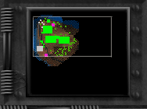
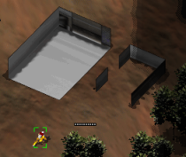
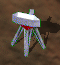
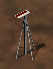
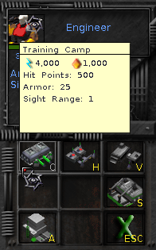
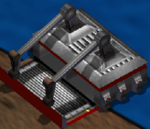
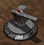

(Avvertenza: questo è un progetto indipendente, l'autore non fa parte del team di sviluppo del gioco ([Bos Wars](https://www.boswars.org/) è &copy; 2004-2013 by Tina Petersen Jensen, Francois Beerten et al., rilasciato come free software sotto licenza GPL v.2). Come tale 1) Questo lavoro potrebbe non essere accurato al 100% e 2) Gli autori del gioco non devono essere contattati per problemi relativi a questo manuale.)

# Indice

- [Introduzione](#introduzione)
- [Menù iniziale](#menù-iniziale)
- [Mappa](#mappa)
  - [Mini-mappa](#mini-mappa)
  - [Menù di gioco](#menù-di-gioco)
  - [Unità](#unità)
  - [Oggetti naturali](#oggetti-naturali)
- [Azioni basilari: selezione e movimento](#azioni-basilari-selezione-e-movimento)
  - [Selezione](#selezione)
  - [Movimento](#movimento)
- [Risorse](#risorse)
  - [Energia](#energia)
  - [Magma](#magma)
- [Costruire strutture](#costruire-strutture)
  - [L'ingegnere](#lingegnere)
  - [Strutture di base](#strutture-di-base)
    - [Vault](#vault-v)
    - [Magma pump](#magma-pump-m)
    - [Radar](#radar-r)
    - [Camera](#camera-c)
    - [Power plant](#power-plant-p)
    - [Nuclear power plant](#nuclear-power-plant-n)
  - [Strutture unità](#strutture-unità)
    - [Training camp](#training-camp-c)
    - [Hospital](#hospital-h)
    - [Vehicle factory](#vehicle-factory-v)
    - [Shipyard](#shipyard-s)
    - [Aircraft factory](#aircraft-factory-a)
  - [Strutture difensive](#strutture-difensive)
    - [Gun turret](#gun-turret-g)
    - [Big gun turret](#big-gun-turret-b)
    - [Cannon](#cannon-c)
    - [Missile silo](#missile-silo-m)
- [Costruire unità](#costruire-unità)
  - [Unità da training camp](#unità-da-training-camp)
  - [Unità da hospital](#unità-da-hospital)
  - [Unità da vehicle factory](#unità-da-vehicle-factory)
  - [Unità da shipyard](#unità-da-shipyard)
  - [Unità da aircraft factory](#unità-da-aircraft-factory)
- [Combattimento](#combattimento)
- [Consigli di strategia](#consigli-di-strategia)

# Introduzione

[Bos Wars](https://www.boswars.org/) è un gioco di strategia in tempo reale (RTS in inglese) rilasciato come software libero (free software). In un gioco RTS in genere si deve conquistare l'intero "mondo" in un determinato livello, distruggendo nel contempo tutti i nemici. Solitamente si inizia in un piccolo angolo con poche risorse e bisogna costruire il proprio esercito (incluse le difese per la propria base) per poter esplorare e conquistare aree sempre più vaste e sconfiggere i nemici che si incontrano. Per far ciò occorre anche gestire le risorse necessarie (energia, materiali) e trovarne sempre di nuove. Ma attenzione, nel buio intanto i nemici si danno da fare con lo stesso scopo, incluso distruggerci, quindi bisogna adottare una strategia efficace e bilanciare le proprie risorse.

# Menù iniziale

All'avvio del programma viene visualizzato il menù iniziale, le cui voci sono abbastanza intuitive, perciò saranno descritte solo sommariamente.

Nota: l'interfaccia del menù è disponibile in varie lingue, tra cui l'italiano, selezionabili nella sezione "Opzioni" ("Options"). Tuttavia all'interno del gioco i vari oggetti sono denominati con il loro nome originale inglese, per cui nel seguito si utilizzeranno i nomi inglesi.

Alcune funzionalità sono al di là dello scopo di questo manuale, come per esempio l'editor delle mappe che permette di creare nuovi livelli partendo da zero o modificando un livello esistente.

Il pulsante "Opzioni" ("Options") permette di settare alcune impostazioni del gioco come la risoluzione video, l'audio, la velocità e così via.

"Carica" ("Load game") serve a riprendere un gioco precedentemente salvato.

Infine "Inizia partita" ("Start game") permette di iniziare un nuovo gioco. Una volta premuto si può scegliere una delle mappe dalla lista a destra (inizialmente si possono ignorare le campagne). Selezionando una mappa se ne possono vedere i dettagli nella parte sinistra, in particolare le sue dimensioni, ad esempio 64x64 per le più piccole, fino a 256x256. Si consiglia vivamente di iniziare con le mappe più piccole se non si è ancora pratici con il gioco, e di lasciare tutte le opzioni al valore predefinito, almeno finché non si è più esperti. Premendo "Inizio" ("Start") si inizia il gioco vero e proprio.

# Mappa

La mappa è dove si svolge il gioco. Si possono distinguere tre tipi di aree:

- Aree pienamente illuminate: aree nel campo visivo delle nostre unità, dove cioè è presente almeno una nostra unità. Grazie alla presenza fisica è possibile vedere cosa sta succedendo in tempo reale. Ogni unità ha una propria distanza visiva, in genere alquanto limitata.
- Aree nere: inizialmente la maggior parte, sono aree dove il giocatore non è mai stato e che saranno scoperte una volta raggiunte. Questa caratteristica può essere disabilitata, in modo da vedere tutta la mappa dall'inizio, ma questo verosimilmente può compromettere le dinamiche del gioco.
- Aree offuscate (parzialmente illuminate): aree dove il giocatore è stato in precedenza, ma che adesso non hanno più nostre unità nelle vicinanze, ad esempio se tutte le unità sono state distrutte. Si può ancora vedere l'area, ma non quello che sta avvenendo attualmente; si può vedere solo una "fotografia" dell'ultima volta che una nostra unità era in zona, così che l'area potrebbe essere piena di nemici ma non è possibile vederli finché delle nostre unità non vi ritornano. Questa caratteristica è chiamata "nebbia di guerra" ("fog of war") e anch'essa può essere disabilitata, ma anche in questo caso ciò potrebbe togliere interesse al gioco.

Si può far scorrere la mappa nelle quattro direzioni muovendo il mouse vicino ai quattro bordi.

## Mini-mappa

La mini-mappa, nell'angolo in alto a destra, fornisce una visione di insieme dell'intera mappa. Ci si può muovere rapidamente nella mappa cliccando e trascinando il mouse nella mini-mappa. Punti di diversi colori indicano differenti tipi di oggetti, ad esempio verde per le nostre unità, blu per quelle nemiche, magenta per sorgenti di magma libere. Costruendo un radar (si veda [Costruire strutture](#costruire-strutture)) si possono vedere tutti gli oggetti importanti nella mini-mappa, anche nelle zone inesplorate.

## Menù di gioco

Premendo F10 durante il gioco si può mettere in pausa la partita ed accedere al menù con le opzioni proprie del gioco, come salvare, abbandonare o cambiare la velocità. I tasti funzione associati ai vari sotto-menù (F5, F9, ecc.) possono essere premuti per accedere direttamente alle relative sezioni. Il sotto-menù "Aiuto" (F1) merita attenzione in quanto elenca una serie di scorciatoie da tastiera e consigli generali che forniscono funzionalità avanzate, non sempre elencate in questo manuale.

## Unità

Le unità (umani, veicoli, fabbriche, strutture, ecc.) risiedono sulla mappa, a meno che non sono attaccate e private di tutto il loro livello di salute, in tal caso sono distrutte e scompaiono. Per esempio il seguente è un ingegnere:

Questo tipetto giallo è molto importante nel gioco. Non può combattere o difendersi, ma può [costruire strutture](#costruire-strutture) e [raccogliere risorse](#risorse), per cui ne parleremo in diversi punti del manuale. Come si può vedere, ogni unità indica il proprio livello di salute con una barra (quando non è al massimo). Quando la barra è vuota l'unità muore.

## Oggetti naturali

Il paesaggio include alberi e rocce che possono essere usati per raccogliere [risorse](#risorse). Gli alberi possono essere distrutti dalle nostre unità armate se sono di ostacolo.

# Azioni basilari: selezione e movimento

## Selezione

Una singola unità può essere selezionata cliccando su di essa con il tasto sinistro, come in questo esempio:

Più unità possono essere selezionate tenendo premuto il tasto shift (maiuscole) mentre si clicca.

Si possono selezionare tutte le unità di uno stesso tipo facendo doppio clic su una di esse:

Si può selezionare un gruppo di unità tracciando un rettangolo attorno ad esse con il tasto sinistro del mouse:

(Nota: sembra esserci un limite al numero massimo di unità selezionabili contemporaneamente).

Quando un'unità è selezionata, a destra della mappa si possono vedere due riquadri: il suo stato attuale (livello di salute e caratteristiche) e un menù di azioni con diversi pulsanti, corrispondenti alle azioni che è possibile far compiere all'unità. Per esempio selezionando un ingegnere:

Si può cliccare su ogni azione, o premere il tasto corrispondente sulla tastiera. Un'azione può mostrare un altro menù con maggiori dettagli. Si può muovere il puntatore del mouse sopra un pulsante per avere una descrizione di un dato elemento. Per ogni unità nel seguito saranno descritte le possibili azioni.

## Movimento

Quando una o più unità sono selezionate, queste possono essere spostate cliccando col tasto destro su una zona vuota (e raggiungibile) della mappa. Le unità cercheranno di trovare il percorso migliore, ognuna alla propria velocità. A volte cliccando con il tasto destro su un oggetto, invece che su un'area vuota, si può far compiere all'unità l'azione giusta per quell'oggetto, a seconda del tipo di unità. Quest'ultima modalità sarà spiegata quando necessario.

# Risorse

Per costruire il proprio crescente esercito, insieme alle strutture, alle difese, ecc., occorrono due tipi di risorse: **energia** e **magma** (minerali). Nella parte alta della mappa è presente un indicatore delle loro quantità e tasso di produzione:

Per ogni tipo di risorsa si può vedere la quantità che si sta producendo (segno +), la quantità che si sta consumando (segno -) e quella accumulata (accumulare riserve è possibile solo se si ha almeno un [vault](#vault-v)).

Le risorse vengono consumate quando gli ingegneri costruiscono oggetti o quando le fabbriche producono unità. Se la quantità prodotta è minore della richiesta, la produzione di unità e strutture rallenta o si ferma completamente.

Vediamo in maggiore dettaglio come raccogliere i due tipi di risorse.

## Energia

A un basso livello l'energia può essere raccolta dagli alberi. A questo scopo si può selezionare un ingegnere e scegliere l'azione "Harvest" (o premere H) nel menù azioni, quindi cliccare su un albero. Un modo più veloce è selezionare un ingegnere e cliccare con il tasto destro su un albero (attenzione: un albero va selezionato cliccando sulla sua base). Quando l'albero è esaurito, l'ingegnere si sposta ad un altro albero, e così via. Ecco un ingegnere intento a raccogliere energia da un albero:

Il modo standard e più efficiente per generare energia, tuttavia, è costruire una centrale elettrica ("power plant" o "nuclear power plant", si veda [costruire strutture](#costruire-strutture)). Non appena si ha un'entrata minima di energia e magma si possono costruire una o più centrali elettriche ed avere una quantità illimitata di energia. Per questo motivo l'energia non è un grosso problema nell'economia del gioco.

## Magma

A un basso livello il magma può essere raccolto dalle rocce. Si può selezionare un ingegnere e usare gli stessi comandi visti per gli alberi per fargli raccogliere magma dalle rocce o dalle distese rocciose:

Le rocce durano per un tempo limitato, fino a che tutte quelle di un'area sono esaurite.

Il modo più efficiente è trovare delle sorgenti di magma e costruire delle pompe per magma su di esse. Una pompa fornisce un flusso continuo di magma. A questo scopo si può selezionare un ingegnere e scegliere l'azione "Build" (o premere B) nel menù azioni, quindi "Magma pump" (M) nel sotto-menù, infine cliccare sulla sorgente di magma per iniziare la costruzione. Un modo più veloce è selezionare un ingegnere e cliccare con il tasto destro sulla sorgente di magma. Di seguito sono raffigurate una sorgente di magma libera e una su cui è stata costruita una pompa:

(esiste anche una sorgente di magma più debole, non raffigurata qui).

Le sorgenti di magma sono spesso rare, e le rocce hanno una durata limitata, per cui il magma è spesso il problema maggiore nella gestione delle risorse. Assicuratevi di cercare nuove sorgenti non appena si espande il proprio dominio. Un buon flusso di magma è la chiave per costruire un esercito corposo velocemente.

(È anche possibile ottenere magma riciclando strutture esistenti, incluse le proprie, ma è un metodo molto inefficiente).

Se si vuole continuare a raccogliere risorse da alberi e rocce anche più avanti nel gioco, si può usare un harvester (si veda [costruire unità](#costruire-unità)), un veicolo specializzato nel raccogliere risorse in maniera più efficace. Si possono impartire ordini a tale veicolo come si fa con gli ingegneri.

# Costruire strutture

Le strutture fisse sono costruite dagli ingegneri. Tali strutture includono impianti di utilità generale, armi difensive e fabbriche che a loro volta possono produrre le unità da combattimento.

Per la sua importanza descriveremo di seguito in dettaglio l'ingegnere.

## L'ingegnere

Un ingegnere può costruire le varie strutture fisse, come accennato, può raccogliere le [risorse](#risorse) in caso di necessità (come descritto in precedenza) e riparare oggetti.

Per costruire una struttura, selezionare un ingegnere e cliccare su uno dei seguenti pulsanti azione (o premere il tasto corrispondente):

- B (Build basic structures) per costruire strutture generiche
- U (Build unit structures) per costruire fabbriche di unità da combattimento
- D (Build defensive structures) per costruire armi di difesa

Ogni sotto-menù elenca le possibili strutture da costruire, descritte nel seguito. Muovendo il puntatore del mouse sopra ognuna si può vedere una lista delle sue caratteristiche, oltre al costo in energia e magma per la sua costruzione (si vedano le immagini nella prossima sezione). In genere gli elementi in un sotto-menù sono ordinati per importanza, dalle unità più economiche ma più deboli fino alle più potenti (ma più dispendiose).

Una volta selezionata la struttura desiderata (cliccandovi o premendo il tasto corrispondente sulla tastiera), si deve cliccare su un'area vuota della mappa con spazio sufficiente per la struttura, la cui forma è indicata in corrispondenza del puntatore del mouse. Infine l'ingegnere inizierà la sua costruzione, come in questo esempio in cui un ingegnere sta costruendo una fabbrica di veicoli (vehicle factory):

La costruzione impiega un certo tempo, con una barra che ne indica l'avanzamento. La barra scompare a costruzione ultimata, ma riappare se viene danneggiata, ad indicare il livello di salute.

Un ingegnere può anche riparare un oggetto danneggiato, o continuare la sua costruzione se non era stata ultimata. A questo scopo il modo più veloce è selezionare un ingegnere e cliccare col tasto destro sull'oggetto.

Si possono assegnare più ingegneri a costruire o riparare un oggetto se si vuole accelerare il processo (ma aumentando l'uso delle risorse); per far ciò si possono selezionare gli altri ingegneri e cliccare col tasto destro sull'oggetto su cui il primo ingegnere sta lavorando.

Se un ingegnere sta costruendo qualcosa e gli viene impartito un nuovo ordine, esso interrompe il lavoro attuale. Si possono però accodare più lavori per uno stesso ingegnere premendo il tasto shift (maiuscole) mentre si clicca: in tal modo i vari lavori verranno eseguiti in successione. Un'altra scorciatoia utile è premere ALT-I per trovare e selezionare automaticamente un ingegnere libero.

Infine gli ingegneri possono essere prodotti come tutte le altre unità se ne servono di più. Nello specifico sono prodotti dal [vault](#vault-v) o dal [training camp](#training-camp-c) (si veda nel seguito).

Suggerimento: assicuratevi di avere almeno un ingegnere vivo, o di avere fabbriche che possono produrli, o non sarete in grado di costruire nuovi oggetti o sostituire quelli distrutti.

## Strutture di base

### Vault ("V")

Il vault può immagazzinare energia e magma, in modo da stoccarne delle riserve per un uso futuro, e può produrre nuovi ingegneri. Di solito un livello possiede un vault in partenza (ma non sempre).

### Magma pump ("M")

Una pompa di magma, costruita su una sorgente di magma, produce un flusso costante di magma. Si veda [risorse](#risorse) per una spiegazione approfondita.

### Radar ("R")

Il radar può rivelare la posizione di oggetti importanti nella [mini-mappa](#mini-mappa), anche in aree inesplorate. Questo permette di puntare strutture lontane con armi a lungo raggio. Per queste ragioni è consigliabile averne uno.

### Camera ("C")

La camera può fornire una visuale dell'area in cui è costruita, così da avere una immagine aggiornata di quell'area.

### Power plant ("P")

Produce una quantità costante di energia. Si veda [risorse](#risorse).

### Nuclear power plant ("N")

Come il power plant, ma produce più energia. Si veda [risorse](#risorse).

## Strutture unità

Nota: i dettagli della costruzione di unità dalle varie strutture unità (fabbriche) sono forniti nel prossimo capitolo.

### Training camp ("C")

Il campo di addestramento (training camp) "produce" combattenti di forma umana, di potenza variabile, più gli ingegneri.

### Hospital ("H")

L'ospedale (hospital) produce solo l'unità "medic".

### Vehicle factory ("V")

La fabbrica di veicoli (vehicle factory) produce veicoli da combattimento, come ad esempio i carri armati.

### Shipyard ("S")

Il cantiere navale (shipyard) produce veicoli acquatici che possono muoversi e combattere in acqua. Lo shipyard deve essere costruito vicino all'acqua.

### Aircraft factory ("A")

La fabbrica di velivoli (aircraft factory) produce veicoli aerei che possono raggiungere ogni punto della mappa per esplorare o combattere.

## Strutture difensive

### Gun turret ("G")

La torretta (gun turret) spara ai nemici non appena sono alla sua portata. Utile per creare una linea di difesa attorno alla propria base.

### Big gun turret ("B")

La torretta grande (big gun turret) è simile alla torretta, ma più potente.

### Cannon ("C")

Il cannone (cannon) spara ad una grande distanza ed è abbastanza potente, tanto che in genere si è colpiti prima ancora di poterlo vedere (il suo colpo appare come una palla di fuoco azzurra). D'altra parte impiega molto tempo a ricaricarsi e non è molto preciso, specialmente con bersagli mobili. Per queste ragioni può essere visto più come un'arma offensiva che difensiva. Insieme la radar permette di colpire unità nemiche anche aree inesplorate.

### Missile silo ("M")

Il silo missili (missile silo) può lanciare missili nucleari molto potenti su ogni bersaglio nella mappa, ma la sua costruzione è molto costosa e impiega molto tempo a ricaricarsi. Anche i missili possono avvantaggiarsi dei bersagli rivelati dal radar.

# Costruire unità
## Unità da training camp
## Unità da hospital
## Unità da vehicle factory
## Unità da shipyard
## Unità da aircraft factory

# Combattimento

# Consigli di strategia

